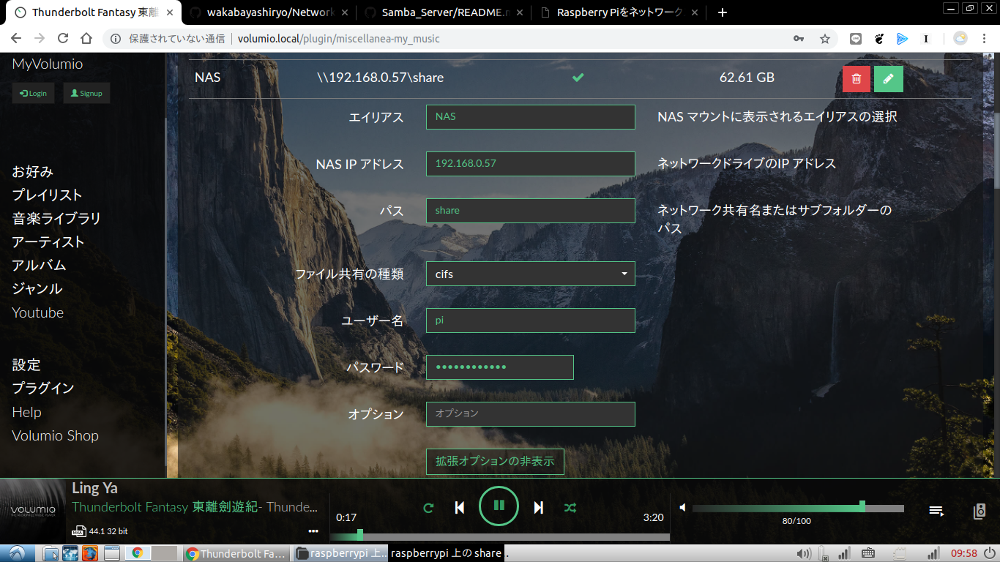

# selector Server

Raspberry Pi Media Player have output selector for RCA jack.
this program control selector using GUI on web browser.
## STEP1: Installation volumio OS [on windows]
[reference site](https://itdecoboconikki.com/2017/02/10/2017volumio-2041install/)
1. Download image file of leatest volumio   
2. Format SD card using SD CardFormatter    
3. Write image file to SD card using Win32DiskImager or use dd command at LINUX   
    > sudo dd bs=1G if=/volumio-2.xxx-yyyy-mm-dd-pi.img of=/dev/xxx status=progress
4. Insert SD card,Power on. don't plug ethernet.   
5. Awhile, connect Access Point using PC or Smart phone    
    *(SSID:Volumio Password:volumio2)*
6. Access http://volumio.local [in local net]
7. Using browser set configration of volumio   
[setting guide for using hardware](http://www.raspberrypiwiki.com/index.php/File:RPI-HIFI-DAC-manual-en.pdf)
8. Reboot   
9. Go to setting selector server    
**If you can not access the volumio,using application to serach IP address**

## STEP2: Installation Selectorserver [on Linux]
1. Access to http://volumio.local/dev and enable SSH.
1. Connect terminal using ssh ,can do by teraterm or linux terminal   
    *(Login name:volumio Password:volumio)*
    > ssh 192.168.0.xx -l volumio   
    >> volumio   
2. Clone this repository 
    > git clone https://github.com/wakabayashiryo/selectorServer.git
3. Install necessary packages for server program 
    > sudo apt-get update   
    > sudo apt-get -y install python3 python3-rpi.gpio python3-flask   

    **Must not to use the "dist-upgrade" command**   
    **Use only updates from the GUI**
4. Add service for automatically run program    
    Copy service files to system folder
    > sudo cp selectorServer/selector.service /etc/systemd/system
6. Start service and enable to automatically run
    > sudo systemctl daemon-reload   
    > sudo systemctl start selector   
    > sudo systemctl enable selector   
7. Check running service
    > sudo systemctl status selector
    ~~~
    ● selector.service
   Loaded: loaded (/etc/systemd/system/selector.service; enabled)
   Active: active (running) since Sun 2019-05-19 02:19:25 UTC; 5min ago
    Main PID: 530 (python3)
    CGroup: /system.slice/selector.service
            ├─530 /usr/bin/python3 /home/volumio/selectorServer/selectorGUI.py
            └─671 /usr/bin/python3 /home/volumio/selectorServer/selectorGUI.py

    May 19 02:19:25 volumio systemd[1]: Starting selector.service...
    May 19 02:19:25 volumio systemd[1]: Started selector.service.
    May 19 02:19:29 volumio python3[530]: * Running on http://0.0.0.0:8080/
    May 19 02:19:29 volumio python3[530]: * Restarting with reloader
    May 19 02:20:44 volumio python3[530]: /home/volumio/selectorServer/selectorGUI.py:26: RuntimeWarning: This channel is already in use, continuing anyway.  Use GPIO.setwarnings(False) to disable warnings.
    May 19 02:20:44 volumio python3[530]: GPIO.setup(Channel1,GPIO.OUT)
    May 19 02:20:44 volumio python3[530]: /home/volumio/selectorServer/selectorGUI.py:27: RuntimeWarning: This channel is already in use, continuing anyway.  Use GPIO.setwarnings(False) to disable warnings.
    May 19 02:20:44 volumio python3[530]: GPIO.setup(Channel2,GPIO.OUT)
    May 19 02:20:44 volumio python3[530]: /home/volumio/selectorServer/selectorGUI.py:28: RuntimeWarning: This channel is already in use, continuing anyway.  Use GPIO.setwarnings(False) to disable warnings.
    May 19 02:20:44 volumio python3[530]: GPIO.setup(Channel3,GPIO.OUT)
    ~~~
8. Reboot

## STEP3: Set Static IP address & Hotspot
1. Setting Icon  >> Network
2. Disable Automatic IP
3. Set Parameter   

    |item|parameter|   
    |:--|:--|   
    |Static IP address|192.168.0.56|    
    |NetMask|255.255.255.0|   
    |GateWay|192.168.0.1|    
    
4. Save Configration
5. Enable Fallback of Hotspot
4. Save Configration

## STEP4: Access Test
- ### mDNS version
    - volumio http://volumio.local   
    - selector http://volumio.local:8080

- ### static IP version

    - volumio http://192.168.0.56/   
    - selector http://192.168.0.56:8080/   
   
## STEP5: Mount Network Drive (Samba Server)
- Setting Network Drive    
    Setting -> MyMusic -> Add Network Drive    
    
    How abount Samba Server   
    https://github.com/wakabayashiryo/Samba_Server/

## ***Important Report***
- dist-upgrade   
    If you use dist-upgrade at ssh,system will occure problems unexpexted.   
    ex)   
    - USB device is not recognized and restarts repeatedly   
    - Crash on router when connecting to 2.4 GHz band   
    
    Must not to use the "dist-upgrade" command.   
    **Use only updates from the GUI.**  

## Manage System
- [Backup Manual](./backup_manual.md)

## topic
- The power status LED of raspberry pi change blinkng patern to heartrate and change the current limit of USB port from 0.6A to 1.2A .

    > sudo nano /boot/config.txt 

    Add the following   

    > dtparam=pwr_led_trigger=heartbeat   
    > max_usb_current=1
    
- Digital Filter assemblied in PCM5122

    [Reference site](https://www.phileweb.com/review/article/201812/04/3283.html)

    > alsamixer
-  If hotspot did not work when setup new network    
    1. Delete Static IP address lines in /etc/dhcpcd.conf
    1. Setting SSID and PSK of New Router in /etc/wpa_supplicant/wpa_supplicant.conf   
        ~~~
        network={
        　　　ssid="SSID"
        　　　psk=password
        }    
        ~~~
    1. Reboot
    1. Serch Volumio's IP address and Resetup
- Register to DNS resolver volumio.local   
    using hostname,will be able to access volumio by android smartphone.
    
    > sudo emacs /etc/hosts
    ~~~
    192.168.0.56    volumio.local
    ~~~
